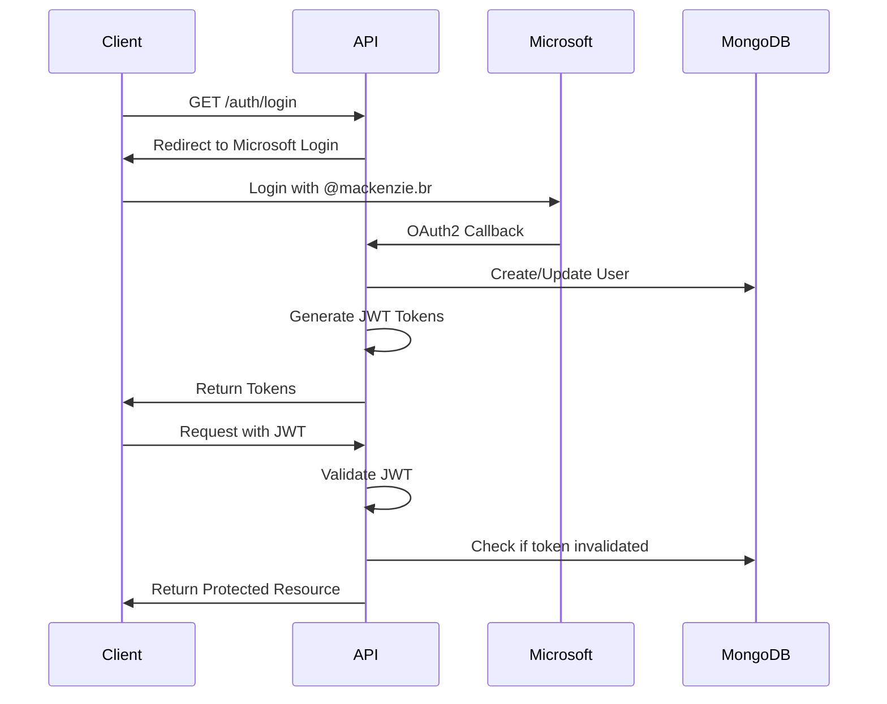

# Mackenzie Authentication Service

Serviço de Autenticação e Autorização do Mackenzie utilizando OAuth2 Microsoft/Outlook, JWT e MongoDB.

## 🚀 Tecnologias

- **Java 21**
- **Spring Boot 3.2.0**
- **Spring Security**
- **OAuth2 Client** (Microsoft/Outlook)
- **JWT (JSON Web Tokens)**
- **MongoDB**
- **Maven**
- **Docker & Docker Compose**

## 📋 Requisitos Funcionais Implementados

### AUTH-RF1: Autenticação via Email Institucional ✅
- Sistema autenticação usuários via email (@mackenzie.br e @mackenzista.com.br)
- Integração OAuth2 com Microsoft/Outlook
- Validação automática de domínios permitidos

### AUTH-RF2: Logout ✅
- Sistema permite logout com invalidação de tokens
- Tokens invalidados são armazenados no MongoDB
- Validação de tokens invalidados em cada requisição

### AUTH-RF3: Controle de Acesso Baseado em Roles ✅
- Implementação RBAC (Role-Based Access Control)
- Middleware de autorização na API
- Roles: ROLE_USER, ROLE_ADMIN, ROLE_PROFESSOR, etc.

## 🏗️ Arquitetura

```
src/main/java/br/mackenzie/auth/
├── AuthApplication.java          # Classe principal
├── controller/
│   └── AuthController.java       # Endpoints REST de autenticação
├── dto/
│   ├── ApiResponse.java          # DTO de resposta genérica
│   ├── AuthResponse.java         # DTO de resposta de autenticação
│   ├── LoginRequest.java         # DTO de requisição de login
│   └── RefreshTokenRequest.java  # DTO de requisição de refresh
├── exception/
│   └── GlobalExceptionHandler.java # Handler global de exceções
├── model/
│   ├── Role.java                 # Entidade Role
│   └── User.java                 # Entidade User
├── repository/
│   ├── RoleRepository.java       # Repositório de Roles
│   └── UserRepository.java       # Repositório de Users
├── security/
│   ├── JwtAuthenticationFilter.java        # Filtro JWT
│   ├── OAuth2LoginSuccessHandler.java      # Handler OAuth2
│   └── SecurityConfig.java                 # Configuração Spring Security
└── service/
    ├── AuthService.java          # Serviço de autenticação
    ├── JwtService.java           # Serviço de geração/validação JWT
    └── UserService.java          # Serviço de gerenciamento de usuários
```

## 🔧 Configuração

### 1. Configurar Credenciais Azure AD

1. Acesse o [Azure Portal](https://portal.azure.com)
2. Vá para "Azure Active Directory" > "App registrations"
3. Crie um novo registro de aplicativo
4. Copie:
   - **Application (client) ID**
   - **Directory (tenant) ID**
   - Crie um **Client Secret**

### 2. Configurar Variáveis de Ambiente

Copie o arquivo `.env.example` para `.env`:

```bash
cp .env.example .env
```

Edite o arquivo `.env` com suas credenciais:

```env
AZURE_CLIENT_ID=seu-client-id
AZURE_CLIENT_SECRET=seu-client-secret
AZURE_TENANT_ID=seu-tenant-id
JWT_SECRET=sua-chave-secreta-minimo-256-bits
```

### 3. Configurar Redirect URI no Azure

No Azure Portal, adicione a seguinte URI de redirecionamento:

```
http://localhost:8080/login/oauth2/code/microsoft
```

Para produção, adicione também:

```
https://seu-dominio.com/api/v1/login/oauth2/code/microsoft
```

## 🐳 Executar com Docker

### Iniciar serviços (MongoDB + Aplicação)

```bash
docker-compose up -d
```

### Ver logs

```bash
docker-compose logs -f auth-service
```

### Parar serviços

```bash
docker-compose down
```

### Limpar volumes (apaga dados do MongoDB)

```bash
docker-compose down -v
```

## 💻 Executar Localmente (sem Docker)

### 1. Instalar MongoDB

```bash
# Ubuntu/Debian
sudo apt-get install mongodb

# MacOS
brew install mongodb-community
```

### 2. Iniciar MongoDB

```bash
mongod --dbpath=/caminho/para/data/db
```

### 3. Executar aplicação

```bash
mvn spring-boot:run
```

## 📡 Endpoints da API

### Base URL
```
http://localhost:8080/api/v1
```

### Autenticação

#### 1. Iniciar Login OAuth2
```http
GET /auth/login
```

Retorna URL para redirecionamento:
```json
{
  "success": true,
  "message": "Redirecione para /oauth2/authorization/microsoft para fazer login",
  "data": {
    "loginUrl": "/oauth2/authorization/microsoft"
  }
}
```

#### 2. Callback OAuth2 (automático após login Microsoft)
```http
GET /auth/oauth2/success?accessToken=...&refreshToken=...&tokenType=Bearer
```

Resposta:
```json
{
  "accessToken": "eyJhbGciOiJIUzI1NiIsInR5cCI6IkpXVCJ9...",
  "refreshToken": "eyJhbGciOiJIUzI1NiIsInR5cCI6IkpXVCJ9...",
  "tokenType": "Bearer",
  "expiresIn": 86400,
  "userInfo": {
    "email": "usuario@mackenzie.br",
    "name": "Nome do Usuário",
    "roles": ["ROLE_USER"]
  }
}
```

#### 3. Renovar Token
```http
POST /auth/refresh
Content-Type: application/json

{
  "refreshToken": "eyJhbGciOiJIUzI1NiIsInR5cCI6IkpXVCJ9..."
}
```

#### 4. Logout
```http
POST /auth/logout
Authorization: Bearer {accessToken}
```

#### 5. Obter Usuário Atual
```http
GET /auth/me
Authorization: Bearer {accessToken}
```

#### 6. Validar Token
```http
GET /auth/validate
Authorization: Bearer {accessToken}
```

### Endpoints Protegidos por Role

#### Admin Test (apenas ROLE_ADMIN)
```http
GET /auth/admin/test
Authorization: Bearer {accessToken}
```

## 🔐 Fluxo de Autenticação



## 🛡️ Segurança

- **OAuth2**: Autenticação delegada ao Microsoft/Outlook
- **JWT**: Tokens assinados com HS256
- **CORS**: Configurado para origins permitidas
- **CSRF**: Desabilitado (API REST stateless)
- **Stateless**: Sessões não são mantidas no servidor
- **Role-Based Access**: Controle granular de permissões
- **Token Invalidation**: Logout efetivo com blacklist de tokens

## 📊 MongoDB Collections

### Users
```javascript
{
  "_id": ObjectId("..."),
  "email": "usuario@mackenzie.br",
  "name": "Nome do Usuário",
  "microsoftId": "azure-ad-user-id",
  "roles": [
    { "$ref": "roles", "$id": ObjectId("...") }
  ],
  "accountNonExpired": true,
  "accountNonLocked": true,
  "credentialsNonExpired": true,
  "enabled": true,
  "createdAt": ISODate("2025-10-10T12:00:00Z"),
  "lastLoginAt": ISODate("2025-10-10T14:30:00Z"),
  "lastLoginIp": "192.168.1.1",
  "invalidatedTokens": ["token1", "token2"]
}
```

### Roles
```javascript
{
  "_id": ObjectId("..."),
  "name": "ROLE_USER",
  "description": "Usuário padrão do sistema"
}
```

## 🧪 Testes

```bash
# Executar todos os testes
mvn test

# Executar testes com cobertura
mvn test jacoco:report
```

## 📝 Configurações Avançadas

### Alterar tempo de expiração do JWT

Edite `application.yml`:

```yaml
jwt:
  expiration: 3600000  # 1 hora (em milissegundos)
  refresh-expiration: 604800000  # 7 dias
```

### Adicionar novos domínios de email

Edite `application.yml`:

```yaml
mackenzie:
  allowed-email-domains:
    - mackenzie.br
    - mackenzista.com.br
    - novoDominio.com.br
```

### Definir emails de administradores

Edite `application.yml`:

```yaml
mackenzie:
  admin-emails:
    - admin@mackenzie.br
    - coordenador@mackenzie.br
```

## 🚀 Deploy AWS

### Opções de Deploy

1. **AWS ECS (Elastic Container Service)**
   - Usar Docker image criada
   - Configurar task definition
   - Usar Application Load Balancer

2. **AWS Elastic Beanstalk**
   - Deploy direto do JAR
   - Auto-scaling configurável

3. **AWS EKS (Kubernetes)**
   - Para alta disponibilidade
   - Múltiplas réplicas

### MongoDB na AWS

Opções:
- **MongoDB Atlas**: Serviço gerenciado
- **AWS DocumentDB**: Compatível com MongoDB
- **Self-hosted EC2**: MongoDB em EC2 instance

## 📚 Documentação Adicional

- [Spring Security OAuth2](https://spring.io/guides/tutorials/spring-boot-oauth2/)
- [Microsoft Identity Platform](https://docs.microsoft.com/azure/active-directory/develop/)
- [JWT.io](https://jwt.io/)
- [MongoDB Spring Data](https://spring.io/projects/spring-data-mongodb)

## 👥 Contribuindo

1. Fork o projeto
2. Crie uma branch para sua feature (`git checkout -b feature/AmazingFeature`)
3. Commit suas mudanças (`git commit -m 'Add some AmazingFeature'`)
4. Push para a branch (`git push origin feature/AmazingFeature`)
5. Abra um Pull Request

## 📄 Licença

Este projeto está sob a licença MIT.

## ✉️ Contato

Equipe Mackenzie - desenvolvimento@mackenzie.br

---

**Desenvolvido com ❤️ pela equipe Mackenzie**
