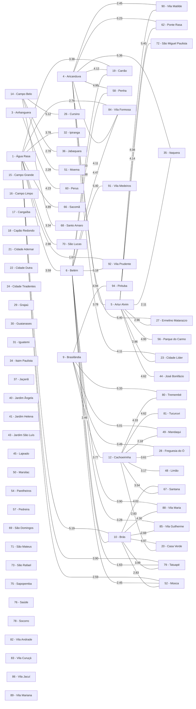

# Modelagem do Grafo em Mermaid (Resumo)

Tipo do grafo: 3
Vértices: 71
Arestas exibidas no resumo: 60

## Subgrafo para visualização rápida

```mermaid
graph LR
  N1["1 - Água Rasa"]
  N3["3 - Anhanguera"]
  N4["4 - Aricanduva"]
  N5["5 - Artur Alvim"]
  N6["6 - Belém"]
  N9["9 - Brasilândia"]
  N10["10 - Brás"]
  N12["12 - Cachoeirinha"]
  N14["14 - Campo Belo"]
  N15["15 - Campo Grande"]
  N16["16 - Campo Limpo"]
  N17["17 - Cangaíba"]
  N18["18 - Capão Redondo"]
  N19["19 - Carrão"]
  N20["20 - Casa Verde"]
  N21["21 - Cidade Ademar"]
  N22["22 - Cidade Dutra"]
  N23["23 - Cidade Líder"]
  N24["24 - Cidade Tiradentes"]
  N26["26 - Cursino"]
  N27["27 - Ermelino Matarazzo"]
  N28["28 - Freguesia do Ó"]
  N29["29 - Grajaú"]
  N30["30 - Guaianases"]
  N31["31 - Iguatemi"]
  N32["32 - Ipiranga"]
  N34["34 - Itaim Paulista"]
  N35["35 - Itaquera"]
  N36["36 - Jabaquara"]
  N37["37 - Jaçanã"]
  N40["40 - Jardim Ângela"]
  N41["41 - Jardim Helena"]
  N43["43 - Jardim São Luís"]
  N44["44 - José Bonifácio"]
  N45["45 - Lajeado"]
  N48["48 - Limão"]
  N49["49 - Mandaqui"]
  N50["50 - Marsilac"]
  N51["51 - Moema"]
  N52["52 - Mooca"]
  N54["54 - Parelheiros"]
  N56["56 - Parque do Carmo"]
  N57["57 - Pedreira"]
  N58["58 - Penha"]
  N60["60 - Perus"]
  N62["62 - Ponte Rasa"]
  N66["66 - Sacomã"]
  N67["67 - Santana"]
  N68["68 - Santo Amaro"]
  N69["69 - São Domingos"]
  N70["70 - São Lucas"]
  N71["71 - São Mateus"]
  N72["72 - São Miguel Paulista"]
  N73["73 - São Rafael"]
  N75["75 - Sapopemba"]
  N76["76 - Saúde"]
  N78["78 - Socorro"]
  N79["79 - Tatuapé"]
  N80["80 - Tremembé"]
  N81["81 - Tucuruvi"]
  N82["82 - Vila Andrade"]
  N83["83 - Vila Curuçá"]
  N84["84 - Vila Formosa"]
  N85["85 - Vila Guilherme"]
  N86["86 - Vila Jacuí"]
  N88["88 - Vila Maria"]
  N89["89 - Vila Mariana"]
  N90["90 - Vila Matilde"]
  N91["91 - Vila Medeiros"]
  N92["92 - Vila Prudente"]
  N94["94 - Pirituba"]
  N1 ---|3.59| N6
  N1 ---|5.19| N10
  N1 ---|3.38| N19
  N1 ---|3.78| N32
  N1 ---|2.59| N52
  N1 ---|4.89| N66
  N1 ---|2.96| N70
  N1 ---|3.90| N79
  N1 ---|2.78| N84
  N1 ---|1.67| N92
  N3 ---|4.23| N60
  N4 ---|3.78| N5
  N4 ---|4.12| N19
  N4 ---|4.11| N23
  N4 ---|5.40| N27
  N4 ---|5.36| N35
  N4 ---|4.95| N58
  N4 ---|5.23| N62
  N4 ---|4.11| N84
  N4 ---|2.45| N90
  N5 ---|2.96| N23
  N5 ---|2.96| N27
  N5 ---|2.11| N35
  N5 ---|4.62| N44
  N5 ---|4.95| N56
  N5 ---|4.14| N62
  N5 ---|5.40| N72
  N5 ---|4.08| N90
  N6 ---|2.46| N10
  N6 ---|4.03| N19
  N6 ---|2.45| N52
  N6 ---|5.38| N58
  N6 ---|1.63| N79
  N6 ---|4.47| N84
  N6 ---|3.28| N85
  N6 ---|3.90| N88
  N6 ---|5.40| N91
  N6 ---|5.18| N92
  N9 ---|3.77| N12
  N9 ---|3.49| N28
  N9 ---|5.01| N49
  N9 ---|5.33| N80
  N9 ---|4.94| N94
  N10 ---|4.97| N20
  N10 ---|2.83| N52
  N10 ---|4.02| N67
  N10 ---|3.99| N79
  N10 ---|2.66| N85
  N10 ---|4.30| N88
  N12 ---|2.83| N20
  N12 ---|3.61| N28
  N12 ---|3.17| N48
  N12 ---|2.18| N49
  N12 ---|3.54| N67
  N12 ---|4.33| N80
  N12 ---|4.62| N81
  N14 ---|5.12| N26
  N14 ---|2.78| N36
  N14 ---|2.28| N51
  N14 ---|3.34| N68
```
