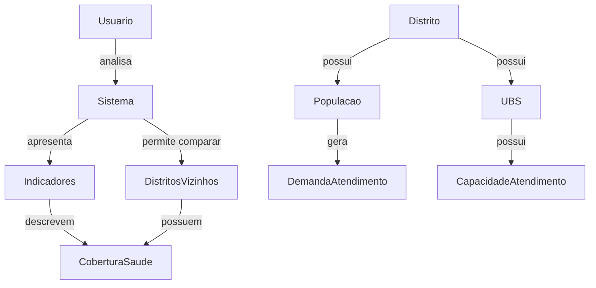
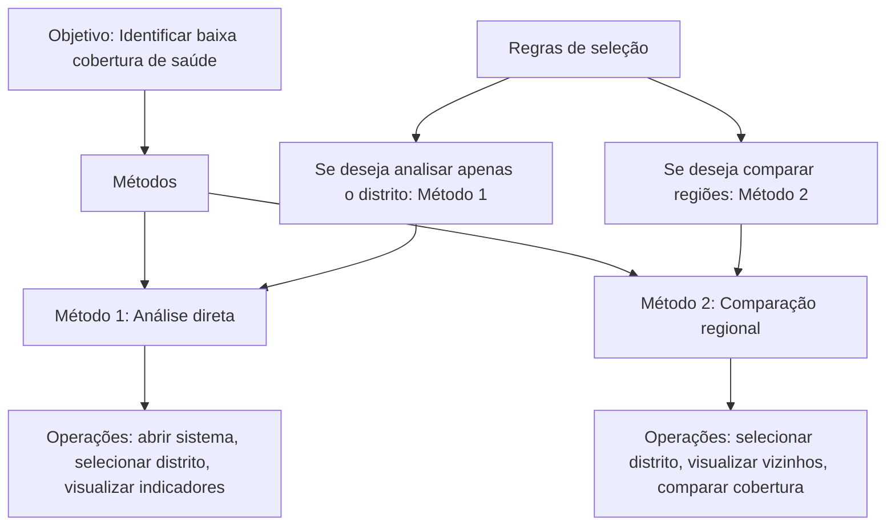
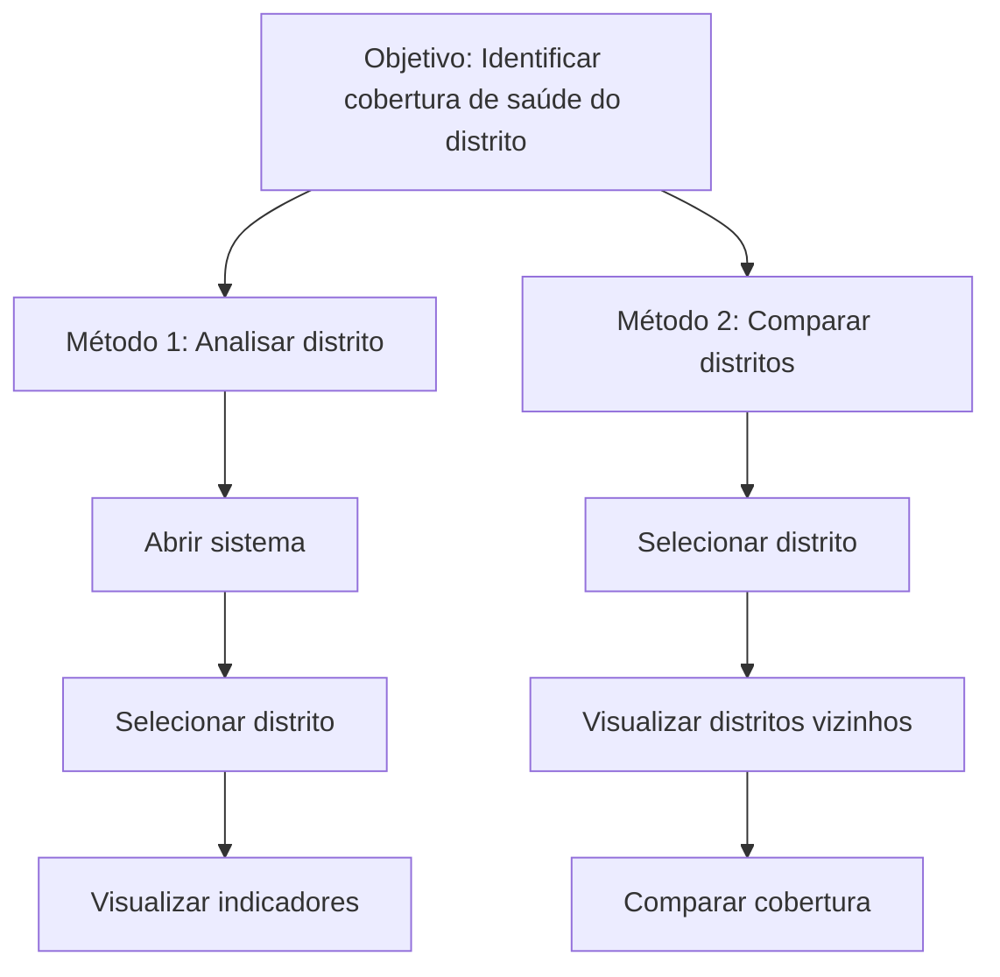

# Análise de Tarefas – Projeto RedeAcesso-SP

###### Feito por: Anna Luiza Stella Santos - 10417401  
######            Lendy Naiara Carpio Pacheco - 10428525  
######            Lucas Fernandes de Camargo - 10419400

## Contexto

O projeto **RedeAcesso-SP** consiste em um sistema interativo destinado à análise da distribuição de serviços de saúde na cidade de São Paulo. Para isso, utiliza conceitos de **Teoria dos Grafos**, representando distritos como vértices e suas relações territoriais como conexões entre regiões.

O sistema tem como objetivo permitir a visualização e exploração de indicadores relevantes relacionados ao acesso à saúde, tais como:

- número de UBS por distrito;
- relação entre população e capacidade de atendimento;
- comparação entre distritos vizinhos;
- identificação de desigualdades territoriais no acesso aos serviços de saúde.

A análise de tarefas apresentada a seguir foi elaborada com base nos cenários previamente definidos no projeto e busca compreender como os usuários interagem com o sistema para interpretar os dados apresentados.

---

## Foco em Interação Humano-Computador (IHC)

Esta análise é orientada pelos princípios de **Interação Humano-Computador (IHC)**, considerando principalmente **quem utiliza o sistema**, **em qual contexto ele é utilizado** e **como a interface apoia o processo de compreensão e tomada de decisão**.

### Perfil de usuários

Os principais usuários considerados no projeto são:

- gestores públicos da área da saúde;
- analistas de dados e planejamento em saúde pública;
- estudantes e pesquisadores interessados em análise territorial e políticas públicas.

### Contexto de uso

O sistema pode ser utilizado em diferentes situações, tais como:

- consulta rápida de indicadores de saúde por distrito;
- comparação entre regiões para apoiar decisões de planejamento;
- exploração visual dos dados para identificação de desigualdades no acesso aos serviços de saúde.

### Metas de usabilidade

Com base nos princípios de IHC, foram estabelecidas as seguintes metas de usabilidade para o sistema:

- **eficácia**: permitir identificar distritos com baixa cobertura de saúde de forma clara e sem ambiguidade;
- **eficiência**: reduzir o número de passos necessários para acessar os indicadores principais;
- **facilidade de aprendizado**: possibilitar que novos usuários compreendam o funcionamento do sistema com pouca ou nenhuma instrução prévia;
- **satisfação**: oferecer uma navegação clara, com feedback visual adequado e linguagem acessível.

### Critérios de avaliação (IHC)

Para orientar o projeto da interface, foram considerados os seguintes critérios de usabilidade:

- **visibilidade do estado do sistema**, garantindo que indicadores e filtros ativos estejam sempre visíveis;
- **consistência de termos**, mantendo o uso padronizado de conceitos como distrito, cobertura e capacidade de atendimento;
- **prevenção de erros**, evitando interpretações equivocadas durante a comparação entre regiões;
- **reconhecimento em vez de memorização**, mantendo informações importantes sempre acessíveis ao usuário.

---

## 1. Rede de Proposições

A **rede de proposições** representa as relações conceituais entre os elementos presentes no domínio do sistema e nas tarefas realizadas pelos usuários.

Cada proposição descreve uma relação simples entre entidades relevantes para a compreensão do problema analisado.

### Proposições

- O usuário analisa informações apresentadas pelo sistema;
- O sistema apresenta indicadores relacionados à saúde;
- Os indicadores descrevem a cobertura de atendimento em cada região;
- Cada distrito possui uma determinada população;
- Cada distrito possui unidades básicas de saúde (UBS);
- Cada UBS possui uma capacidade de atendimento;
- A população gera demanda por serviços de saúde;
- O sistema permite a comparação entre distritos vizinhos.

### Diagrama da Rede de Proposições

## 2. Questionamentos Sistemáticos

A partir da rede de proposições, foram elaborados questionamentos sistemáticos que representam dúvidas reais que podem surgir durante a interação do usuário com o sistema.

Essas perguntas ajudam a identificar quais informações a interface deve apresentar de forma clara e acessível.

### Sobre o distrito

- Quantas UBS existem neste distrito?
- Qual é a população desse distrito?
- A quantidade de UBS é suficiente para atender a população local?

### Sobre capacidade de atendimento

- Qual é a capacidade de atendimento das UBS presentes no distrito?
- Existe sobrecarga no atendimento?
- A relação entre população e capacidade de atendimento é adequada?

### Sobre comparação entre regiões

- Distritos vizinhos possuem mais unidades de saúde?
- Existem regiões com menor cobertura de atendimento?
- Quais distritos apresentam maior desigualdade no acesso aos serviços de saúde?

## 3. Modelo GOMS

O modelo GOMS descreve as tarefas realizadas pelo usuário durante a interação com o sistema, destacando os objetivos, as operações executadas e os diferentes caminhos possíveis para realizar uma tarefa.

### Objetivo

Identificar se o distrito selecionado possui baixa cobertura de serviços de saúde em relação à sua população.

### Operações

As operações representam ações básicas realizadas pelo usuário:

- abrir o sistema;
- selecionar um distrito;
- visualizar indicadores;
- comparar informações com distritos vizinhos.

### Métodos

Os métodos representam diferentes formas de alcançar o objetivo definido.

**Método 1 – Análise direta**

- abrir o sistema;
- selecionar um distrito;
- visualizar os indicadores de cobertura de saúde.

**Método 2 – Comparação regional**

- selecionar um distrito;
- visualizar distritos vizinhos;
- comparar os indicadores de cobertura entre regiões.

### Regras de seleção

- Se o usuário deseja analisar apenas a situação do distrito selecionado → utilizar Método 1;
- Se o usuário deseja compreender diferenças entre regiões → utilizar Método 2.

### Diagrama do modelo GOMS

## 4. Estrutura de Tarefas (HTA)

A Hierarchical Task Analysis (HTA) representa a decomposição hierárquica da tarefa principal realizada pelo usuário dentro do sistema.

