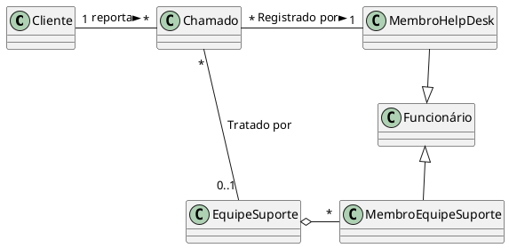
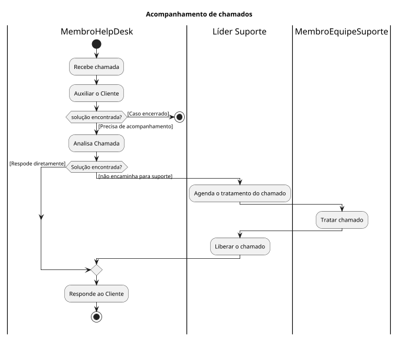
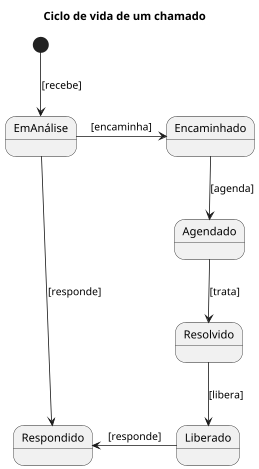
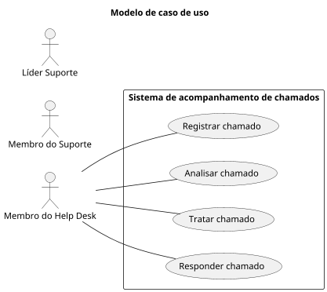

# Sistema de Acompanhamento de chamadas

Desejamos implementar um sistema para dar suporte ao registro e 
tratamento de chamados de clientes em uma dada empresa.
Para que possamos entender como dar suporte a este processo, 
precisamos entender como funciona a criação, o registro e o tratamento de chamados da empresa. A este primeiro passo chamados de análise de negócio e nesta fase construímos um modelo de análise de negócio. Conhecendo o negócio, suas entidades e seus processos, somos capazes de identificar o que pode ser implementado em um sistema para dar suporte aos responsáveis pela execução do processo de registro e tratamento de chamados. Nesta fase definimos os requisitos do sistema que será implementado (requisitos de software) construindo o modelo de casos de uso.
A fase seguinte, sabendo o que o software irá realizar é a fase de Análise e Projeto de Software. Nesta fase definimos o mapa de navegação, o modelo de análise, o modelo de projeto, o modelo de dados e o modelo de implantação

# Análise de negócios - Espaço do problema
## Modelo de domínio de negócios

Para a construção do modelo de negócios começamos pela construção 
do modelo de domínio onde modelamos a estrutura da organização e 
informação.
Empregados, times e sistemas de informação são objetos ativos (ou  Business Workers) e objetos passivos, como documentos, artefatos, produtos são chamados de entidades de negócios. 

Representamos estes objetos ativos e entidades de negócios em  diagramas de classe de domínio.

## Diagrama de classes de domínio

### Procesos de negócios
Em seguida precisamos entender como um chamado é tratado pelos 
funcionários da empresa. Iremos modelar os processos de negócios. Para 
modelar processos utilizaremos diagramas de atividade.
Em alto nível de abstração podemos modelar o processo iniciando com 
um evento de recebimento de uma chamada do cliente, o tratamento do 
chamado reportado e por fim, encerrando com a chamada de retorno ao  cliente.

O processo, com os respectivos responsáveis pela execução das 
atividades foram modelados no diagrama de atividades utilizando raias 
no diagrama de atividades.

## Diagrama de atividades

## Ciclo de Vida de Entidades de Interesse

Podemos verificar que o ciclo de vida da entidade de negócio Chamado é 
bastante complexo. Vamos modelar seu ciclo de vida utilizando um 
diagrama de estados.

### Ciclo de vida de um Chamado

# Especificação da solução
## Requisitos
Com todo o conhecimento do domínio de negócio é possível definirmos o 
que o nosso sistema pode fazer pelos usuários. Para tanto iremos 
construir um modelo de caso de uso. 
Para construir o modelo de caso de uso, basta seguir os seguintes passos:
1. Identifique os atores. Quem irá utilizar o nosso sistema, pensando 
em papéis de usuários.
2. Identifique os casos de uso: o que os atores querem alcançar 
utilizando o sistema? Quais são suas metas ao utilizar o sistema.
3. Para cada caso de uso identificado, especificar a interação entre o 
ator e o sistema.

### Representação de atores de caso de uso
Para identificar e representar os atores e os casos de uso utilizamos o 
diagrama de casos de uso, como apresentado no diagrama.

